# TECH CHALLENGE B

## Visão geral
Este projeto constrói a base de um sistema de suporte à decisão clínica usando aprendizado de máquina aplicado ao diagnóstico de câncer de mama. A solução reúne processamento de dados, pré-processamento, treinamento e validação de modelos para fornecer um pipeline reproduzível e orientado a métricas de segurança clínica.

## Objetivo do projeto
- Desenvolver um pipeline de Machine Learning capaz de analisar automaticamente exames médicos.
- Priorizar desempenho em recall para reduzir falsos negativos em detecção de casos malignos.
- Validar e comparar múltiplos modelos clássicos de classificação.

## Funcionalidades principais
- Carregamento e limpeza de dados
- Pré-processamento de features e target com normalização (StandardScaler)
- Treinamento de modelos de classificação com persistência em `.pkl`
- Avaliação com métricas de classificação balanceadas e AUC-ROC
- Comparação de modelos com critério primário em recall (classe maligno)
- Identificação dos IDs de pacientes com falsos negativos no conjunto de teste
- Execução automática via pipeline

## Tecnologias
- Python
- scikit-learn
- pandas
- NumPy
- Matplotlib
- Seaborn
- joblib
- Jupyter Notebook (análises exploratórias)

## Como executar
1. Clone o repositório:
```bash
git clone <URL_DO_REPOSITORIO>
cd "PROJETO Fase 1 - Tech challenge B"
```
2. Crie e ative um ambiente virtual:
```bash
python -m venv .venv
.venv\Scripts\activate
```
3. Instale as dependências:
```bash
pip install -r requirements.txt
```
4. Execute o pipeline completo:
```bash
python -m src.pipeline.training_pipeline
```

## Dados
O dataset utilizado é o Breast Cancer Wisconsin Dataset. Os dados brutos devem estar presentes em `data/machine_learning/raw/data.csv`.

- Fonte: https://www.kaggle.com/datasets/uciml/breast-cancer-wisconsin-data/data
- Tipo: classificação binária (benigno vs maligno)
- Observações: 569 amostras, 30 features numéricas, leve desbalanceamento entre classes (~63% benigno, ~37% maligno)

## Estrutura do projeto
- `data/`
  - `machine_learning/`
    - `raw/`: dados originais
    - `processed/`: datasets preparados para treino, validação e teste
- `models/`
  - `machine_learning/`: modelos treinados salvos em formato `.pkl`
- `notebooks/`: análises exploratórias e visualizações (`eda.ipynb`)
- `src/`: código-fonte do projeto
  - `machine_learning/`
    - `data/`: carregamento e pré-processamento dos dados
    - `training.py`: treinamento dos modelos
    - `validation.py`: seleção do melhor modelo
    - `test.py`: avaliação final no conjunto de teste
  - `pipeline/`: fluxo de treinamento e validação (`training_pipeline.py`)

## Documentação técnica

- [Arquitetura do sistema](docs/arquitetura.md) — componentes, decisões arquiteturais e integrações
- [Estratégia de testes](docs/testes.md) — metodologia de validação, métricas e reprodutibilidade

## Decisões arquiteturais

### Separação em três conjuntos (64% / 16% / 20%)
A base é dividida em treino, validação e teste com `stratify=y` em ambas as etapas de split, preservando a proporção de classes (Maligno/Benigno) nos três conjuntos. O conjunto de **teste permanece completamente isolado** até a avaliação final — não é usado em nenhuma etapa de seleção de modelo.

### StandardScaler: fit exclusivamente no treino
O `StandardScaler` executa `fit_transform` apenas em `X_train`. Em `X_val` e `X_test` aplica-se somente `transform`, com os parâmetros aprendidos no treino. Aplicar `fit` em dados de avaliação constituiria **data leakage** — o modelo teria acesso implícito à distribuição estatística dos dados de teste durante o pré-processamento.

### Critério primário: Recall da classe maligno
O ranking de modelos prioriza Recall sobre Accuracy porque o custo de um **falso negativo** (tumor maligno classificado como benigno) é clinicamente muito mais grave do que um **falso positivo**. A Accuracy seria enganosa no dataset levemente desbalanceado (~63% benigno): um modelo que classifica tudo como benigno atingiria 63% de Accuracy sem detectar nenhum caso maligno.

| Critério | Ordem | Justificativa |
|---|---|---|
| Recall maligno | 1º | Minimizar falsos negativos (risco de vida) |
| Precision maligno | 2º | Desempate: reduzir biópsias desnecessárias |
| F1 maligno | 3º | Desempate final: equilíbrio geral |

### Rastreamento de falsos negativos apenas no conjunto de teste
Os IDs originais dos pacientes são preservados somente para o conjunto de teste (`id_test.csv`). Os conjuntos de treino e validação são artefatos internos do processo de aprendizado — seus erros não representam predições sobre pacientes reais. Apenas o holdout set representa predições sobre casos nunca vistos, sendo o único para o qual identificar pacientes com diagnóstico incorreto tem sentido clínico.

## Diagrama de Fluxo

```mermaid
flowchart LR
    START([Inicio])

    subgraph INGESTION ["Ingestao"]
        LOAD["Breast Cancer Wisconsin Dataset<br/>569 amostras - 30 features numericas - Kaggle"]
    end

    subgraph PREP ["Pre-processamento"]
        direction TB
        CLEAN["Remover id, duplicatas<br/>e features com missing rate > 40%"]
        ENCODE["Label Encoding: Maligno=1, Benigno=0"]
        SPLIT["Stratified Split<br/>64% treino, 16% val, 20% teste"]
        SCALE["StandardScaler<br/>fit no treino, transform em todos os splits"]
        CLEAN --> ENCODE --> SPLIT --> SCALE
    end

    SAVE_DATA[("data/processed/")]

    subgraph TRAINING ["Treinamento"]
        direction TB
        NEXT["Iterar sobre cada classificador<br/>LR, RF, DT, KNN, SVM, GB, ET, MLP"]
        FIT["Fit em X_train"]
        VAL_METRICS["Avaliacao em X_val<br/>Recall, Precision, F1"]
        LOOP{"Proximo<br/>classificador?"}
        NEXT --> FIT --> VAL_METRICS --> LOOP
        LOOP -- Sim --> NEXT
    end

    MODELS[("models/*.pkl")]

    subgraph SELECTION ["Model Selection"]
        direction TB
        RANK["Ranking por Recall maligno<br/>Desempate: Precision e F1"]
        BEST["Melhor modelo: SVM"]
        RANK --> BEST
    end

    subgraph FINAL_EVAL ["Avaliacao Final"]
        direction TB
        HOLDOUT["Avaliar no holdout set"]
        FN{"Falsos negativos<br/>detectados?"}
        TRACK["Rastrear IDs dos pacientes<br/>com falso negativo"]
        REPORT["Accuracy 0.9737 - Recall 0.9524<br/>F1 0.9639 - Falsos Negativos: 2"]
        HOLDOUT --> FN
        FN -- Sim --> TRACK --> REPORT
        FN -- Nao --> REPORT
    end

    END([Fim])

    START --> LOAD
    LOAD --> CLEAN
    SCALE --> SAVE_DATA
    SAVE_DATA --> NEXT
    LOOP -- Nao --> MODELS
    MODELS --> RANK
    BEST --> HOLDOUT
    REPORT --> END
```



## Fluxo do pipeline
1. Carregamento dos dados
2. Limpeza e pré-processamento
   - Remoção da coluna `id`
   - Remoção de colunas com mais de 40% de valores nulos
   - Remoção de duplicatas
   - Codificação do target (M→1, B→0)
   - Divisão estratificada: 64% treino / 16% validação / 20% teste
   - Normalização com `StandardScaler` (ajustado apenas no treino)
3. Treinamento de múltiplos modelos (salvos em `.pkl`)
4. Avaliação e seleção do melhor modelo no conjunto de validação
5. Teste final e relatório de resultados com identificação de falsos negativos

## Modelos avaliados
- Logistic Regression
- Random Forest
- Decision Tree
- KNN
- SVM
- Gradient Boosting
- Extra Trees
- MLP

## Critério de seleção de modelo
A seleção do melhor modelo segue um sistema de ranking em três níveis:
1. **Critério primário:** Recall da classe maligno (minimizar falsos negativos)
2. **Desempate 1:** Precision da classe maligno (minimizar falsos positivos)
3. **Desempate 2:** F1-score da classe maligno

## Métricas de avaliação
- Accuracy
- Precision
- Recall
- F1-score
- AUC-ROC

> O foco principal do projeto é **recall**, para minimizar o número de falsos negativos em casos malignos.

## Resultados principais
- Melhor modelo: `SVM`
- Accuracy: `0.9737`
- Recall (classe maligno): `0.9524`
- F1-score (classe maligno): `0.9639`
- Falsos negativos: `2`


